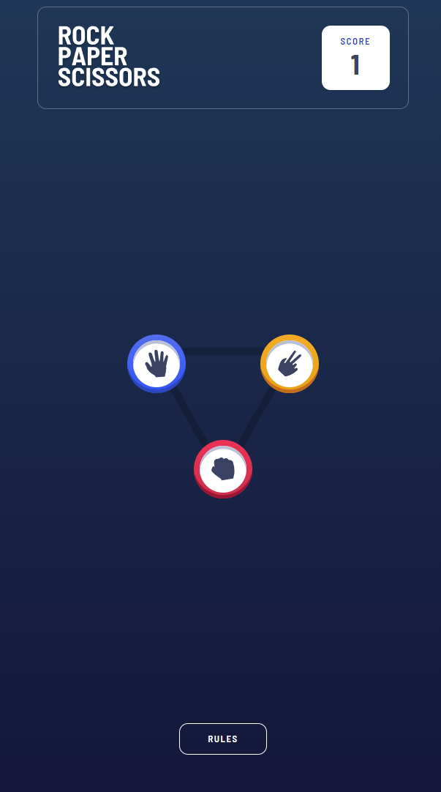

# RPS Game

It is a game of hands in which there are three elements: the stone, which defeats the scissors by breaking it, the scissors, which defeats the paper by cutting it, and the paper, which defeats the stone by wrapping it, giving rise to a closed circle or cycle. (see strange loop), which characterizes the game. It is used very frequently to decide which of two people will do something, as is sometimes done using a coin, or to settle some matter.


## Table of contents

- [Overview](#overview)
  - [The challenge](#the-challenge)
  - [Screenshot](#screenshot)
- [My process](#my-process)
  - [Built with](#built-with)
  - [Code explanation](#code-explanation)
  - [Useful resources](#useful-resources)
- [Author](#author)

## Overview

### The challenge

Player should be able to:

- Player can choose between Rock, Paper or Scissors
- After a short pause it will show that you chose the PC and it will show the winner 
- Player can replay any times he wants

### Screenshot



## My process

### Built with

- Semantic HTML5 markup
- SCSS
- Flexbox

### Code explanation

In this section you can see the explanation of 4 functions used in this project

startGame function

```Js
const restartGame = ()=>{
    playerChoice
    houseChoice
    isPlayerWinner =false
    isADraw = false

    step1.classList.remove("hidden")
    step2.classList.add("hidden")
    playerChoiceBtn.className =""
    houseChoiceBtn.className =""
}
```
This function is used to reset the game state to its initial values after a game has ended. It updates the UI to show the first step of the game and removes any previous game choices or outcomes.

```Js
const changeLayout = ()=>{
    step1.classList.add("hidden")
    setTimeout(()=>{
        step2.classList.remove("hidden")
        displayWinner()},1000)

    playerChoiceBtn.classList.add(playerChoice)
    playerBtnImg.innerHTML =`
        
    `
    houseChoiceBtn.classList.add(houseChoice)
    houseBtnImg.innerHTML =`
        
    `
}
```

This function is used to update the UI to show the game choices made by the player and the house. It adds CSS classes and images to the relevant HTML elements to display these choices, and it sets a timeout to delay showing the game outcome for 1 second to create a more dramatic effect. The displayWinner function is likely called after this timeout to determine the winner and display the relevant outcome on the UI.

```Js
const checkWinner =()=>{
    
    if(playerChoice =="paper" && houseChoice =="rock"){
        isPlayerWinner = true
    }else if( playerChoice =="scissors" && houseChoice =="paper"){
        isPlayerWinner = true
    }else if( playerChoice =="rock" && houseChoice =="scissors"){
        isPlayerWinner = true
    }else if(playerChoice == houseChoice ){
        isADraw = true
    }else{
        isPlayerWinner = false
    }  
}
```

This function is used to determine the winner of the game based on the player's and house's choices. It sets the relevant variables isPlayerWinner or isADraw to true or false depending on the outcome of the game. This function is likely called after the player and house have made their choices to determine the outcome of the game.

```Js
const getHouseChoice = ()=>{
    const choices =["paper","scissors","rock"]
    houseChoice = choices[Math.floor(Math.random()*3)]
}
```
This function is used to select a random choice from the choices array and assign it to the variable houseChoice. It simulates the house's choice in the game, which is needed to determine the winner of the game. This function is likely called before the checkWinner function to determine the outcome of the game.

```Js
const displayWinner = ()=>{
    if(isPlayerWinner){
        score++
        winnerDisplay.innerText = "you win"
        scoreDisplay.innerText = score
    }else if(isADraw){
        winnerDisplay.innerText = "draw"
        
    }else{
        winnerDisplay.innerText = "you lose"
    }
}
```
This function is used to display the outcome of the game to the user based on the values of the isPlayerWinner and isADraw variables. It updates the text content of the winnerDisplay element accordingly and increments the score variable if the player wins the game. This function is likely called after the checkWinner function to display the outcome of the game to the user.

### Useful resources

- [Set Interval](https://www.w3schools.com/jsref/met_win_setinterval.asp)
- [Target Event Property](https://www.w3schools.com/jsref/event_target.asp)

## Author

- Github - [Ricardo Halmoguera](https://github.com/RickHalmoguera)

- Frontend Mentor - [@RickHalmoguera](https://www.frontendmentor.io/profile/RickHalmoguera)


